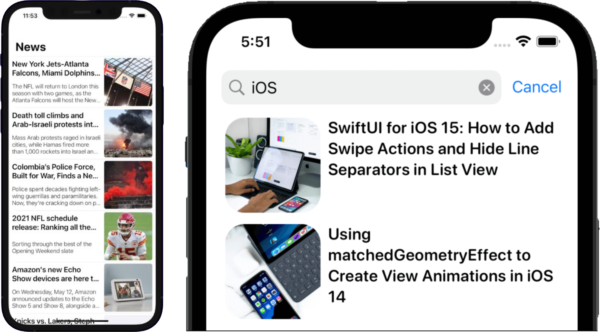

# Daily News
Die Zeitschrift **Daily News** möchte eine Nachrichten App für `iOS` entwickeln. Du bekommst den Auftrag, einen ersten Prototypen mit `SwiftUI` zu programmieren.

    

## Arbeitsauftrag
Entwickle einen Protoypen der `SwiftUI` App "Daily News". Folgendes ist dabei wichtig:
- Verwende die offizielle NewsAPI: **https://newsapi.org/**
  > Lies dir die Dokumentation gut durch, du benötigst einen API key (für die Entwicklung kostenlos). Außerdem hat die API einige sehr nützliche Features, die du verwenden kannst!
- Im Hauptscreen der App soll eine Liste aus aktuellen Nachrichten angezeigt werden
- In der App soll es die Möglichkeit geben, nach Keywords zu suchen. Beispielsweise soll der User in der Suchleiste das Wort "iOS" eingeben können um sich alle Artikel die das Wort "iOS" enthalten anzeigen zu lassen.  
  > Idealerweise kannst du hier in der Suche noch mehr Features einbauen, wie die Suche von Artikeln aus einem bestimmten Land oder nach einem bestimmten Datum, etc.
- Es soll einen "Einstellungen" Screen geben, in. dem man das Verhalten der App steuern kann. Hier soll es auch die Möglichkeit geben, einen API Key einzugeben (Für Testzwecke)

Viel Erfolg!
